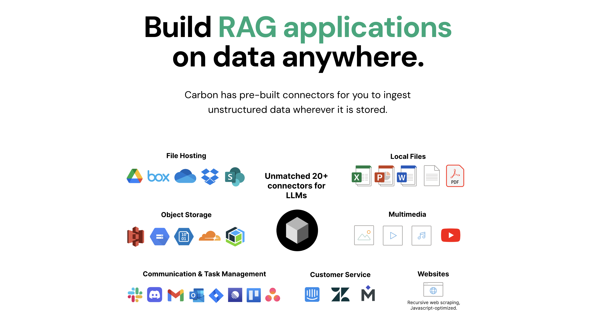

<div align="center">

[](https://carbon.ai)

# [Carbon](https://carbon.ai)<a id="carbon"></a>

Connect external data to LLMs, no matter the source.

[](https://www.npmjs.com/package/carbon-typescript-sdk/v/0.1.1)

</div>

## Table of Contents<a id="table-of-contents"></a>

<!-- toc -->

- [Installation](#installation)
- [Getting Started](#getting-started)
- [Reference](#reference)
  * [`carbon.auth.getAccessToken`](#carbonauthgetaccesstoken)
  * [`carbon.auth.getWhiteLabeling`](#carbonauthgetwhitelabeling)
  * [`carbon.dataSources.queryUserDataSources`](#carbondatasourcesqueryuserdatasources)
  * [`carbon.dataSources.revokeAccessToken`](#carbondatasourcesrevokeaccesstoken)
  * [`carbon.embeddings.getDocuments`](#carbonembeddingsgetdocuments)
  * [`carbon.embeddings.getEmbeddingsAndChunks`](#carbonembeddingsgetembeddingsandchunks)
  * [`carbon.embeddings.uploadChunksAndEmbeddings`](#carbonembeddingsuploadchunksandembeddings)
  * [`carbon.files.createUserFileTags`](#carbonfilescreateuserfiletags)
  * [`carbon.files.delete`](#carbonfilesdelete)
  * [`carbon.files.deleteFileTags`](#carbonfilesdeletefiletags)
  * [`carbon.files.deleteMany`](#carbonfilesdeletemany)
  * [`carbon.files.getParsedFile`](#carbonfilesgetparsedfile)
  * [`carbon.files.getRawFile`](#carbonfilesgetrawfile)
  * [`carbon.files.queryUserFiles`](#carbonfilesqueryuserfiles)
  * [`carbon.files.queryUserFilesDeprecated`](#carbonfilesqueryuserfilesdeprecated)
  * [`carbon.files.resync`](#carbonfilesresync)
  * [`carbon.files.upload`](#carbonfilesupload)
  * [`carbon.files.uploadFromUrl`](#carbonfilesuploadfromurl)
  * [`carbon.files.uploadText`](#carbonfilesuploadtext)
  * [`carbon.health.check`](#carbonhealthcheck)
  * [`carbon.integrations.connectFreshdesk`](#carbonintegrationsconnectfreshdesk)
  * [`carbon.integrations.createAwsIamUser`](#carbonintegrationscreateawsiamuser)
  * [`carbon.integrations.getOauthUrl`](#carbonintegrationsgetoauthurl)
  * [`carbon.integrations.listConfluencePages`](#carbonintegrationslistconfluencepages)
  * [`carbon.integrations.listDataSourceItems`](#carbonintegrationslistdatasourceitems)
  * [`carbon.integrations.syncConfluence`](#carbonintegrationssyncconfluence)
  * [`carbon.integrations.syncDataSourceItems`](#carbonintegrationssyncdatasourceitems)
  * [`carbon.integrations.syncFiles`](#carbonintegrationssyncfiles)
  * [`carbon.integrations.syncGmail`](#carbonintegrationssyncgmail)
  * [`carbon.integrations.syncOutlook`](#carbonintegrationssyncoutlook)
  * [`carbon.integrations.syncRssFeed`](#carbonintegrationssyncrssfeed)
  * [`carbon.integrations.syncS3Files`](#carbonintegrationssyncs3files)
  * [`carbon.organizations.get`](#carbonorganizationsget)
  * [`carbon.users.get`](#carbonusersget)
  * [`carbon.users.toggleUserFeatures`](#carbonuserstoggleuserfeatures)
  * [`carbon.utilities.fetchUrls`](#carbonutilitiesfetchurls)
  * [`carbon.utilities.fetchYoutubeTranscripts`](#carbonutilitiesfetchyoutubetranscripts)
  * [`carbon.utilities.processSitemap`](#carbonutilitiesprocesssitemap)
  * [`carbon.utilities.scrapeSitemap`](#carbonutilitiesscrapesitemap)
  * [`carbon.utilities.scrapeWeb`](#carbonutilitiesscrapeweb)
  * [`carbon.utilities.searchUrls`](#carbonutilitiessearchurls)
  * [`carbon.webhooks.addUrl`](#carbonwebhooksaddurl)
  * [`carbon.webhooks.deleteUrl`](#carbonwebhooksdeleteurl)
  * [`carbon.webhooks.urls`](#carbonwebhooksurls)

<!-- tocstop -->

## Installation<a id="installation"></a>

<table>
<tr>
<th width="292px"><code>npm</code></th>
<th width="293px"><code>pnpm</code></th>
<th width="292px"><code>yarn</code></th>
</tr>
<tr>
<td>

```bash
npm i carbon-typescript-sdk
```

</td>
<td>

```bash
pnpm i carbon-typescript-sdk
```

</td>
<td>

```bash
yarn add carbon-typescript-sdk
```

</td>
</tr>
</table>

## Getting Started<a id="getting-started"></a>

```typescript
import { Carbon } from "carbon-typescript-sdk";

// Generally this is done in the backend to avoid exposing API key to the client

const carbonWithApiKey = new Carbon({
  apiKey: "API_KEY",
  customerId: "CUSTOMER_ID",
});

const accessToken = await carbonWithApiKey.auth.getAccessToken();

// Once an access token is obtained, it can be passed to the frontend
// and used to instantiate the SDK client without an API key

const carbon = new Carbon({
  accessToken: accessToken.data.access_token,
});

// use SDK as usual
const whiteLabeling = await carbon.auth.getWhiteLabeling();
// etc.
```

## Reference<a id="reference"></a>


### `carbon.auth.getAccessToken`<a id="carbonauthgetaccesstoken"></a>

Get Access Token

#### 🛠️ Usage<a id="🛠️-usage"></a>

```typescript
const getAccessTokenResponse = await carbon.auth.getAccessToken();
```

#### 🔄 Return<a id="🔄-return"></a>

[TokenResponse](./models/token-response.ts)

#### 🌐 Endpoint<a id="🌐-endpoint"></a>

`/auth/v1/access_token` `GET`

[🔙 **Back to Table of Contents**](#table-of-contents)

---


### `carbon.auth.getWhiteLabeling`<a id="carbonauthgetwhitelabeling"></a>

Returns whether or not the organization is white labeled and which integrations are white labeled

:param current_user: the current user
:param db: the database session
:return: a WhiteLabelingResponse

#### 🛠️ Usage<a id="🛠️-usage"></a>

```typescript
const getWhiteLabelingResponse = await carbon.auth.getWhiteLabeling();
```

#### 🔄 Return<a id="🔄-return"></a>

[WhiteLabelingResponse](./models/white-labeling-response.ts)

#### 🌐 Endpoint<a id="🌐-endpoint"></a>

`/auth/v1/white_labeling` `GET`

[🔙 **Back to Table of Contents**](#table-of-contents)

---


### `carbon.dataSources.queryUserDataSources`<a id="carbondatasourcesqueryuserdatasources"></a>

User Data Sources

#### 🛠️ Usage<a id="🛠️-usage"></a>

```typescript
const queryUserDataSourcesResponse =
  await carbon.dataSources.queryUserDataSources({});
```

#### ⚙️ Parameters<a id="⚙️-parameters"></a>

##### pagination: [`EmbeddingsAndChunksQueryInputPagination`](./models/embeddings-and-chunks-query-input-pagination.ts)<a id="pagination-embeddingsandchunksqueryinputpaginationmodelsembeddings-and-chunks-query-input-paginationts"></a>

##### order_by: [`OrganizationUserDataSourceOrderByColumns`](./models/organization-user-data-source-order-by-columns.ts)<a id="order_by-organizationuserdatasourceorderbycolumnsmodelsorganization-user-data-source-order-by-columnsts"></a>

##### order_dir: [`OrderDir`](./models/order-dir.ts)<a id="order_dir-orderdirmodelsorder-dirts"></a>

##### filters: [`OrganizationUserDataSourceQueryInputFilters`](./models/organization-user-data-source-query-input-filters.ts)<a id="filters-organizationuserdatasourcequeryinputfiltersmodelsorganization-user-data-source-query-input-filtersts"></a>

#### 🔄 Return<a id="🔄-return"></a>

[OrganizationUserDataSourceResponse](./models/organization-user-data-source-response.ts)

#### 🌐 Endpoint<a id="🌐-endpoint"></a>

`/user_data_sources` `POST`

[🔙 **Back to Table of Contents**](#table-of-contents)

---


### `carbon.dataSources.revokeAccessToken`<a id="carbondatasourcesrevokeaccesstoken"></a>

Revoke Access Token

#### 🛠️ Usage<a id="🛠️-usage"></a>

```typescript
const revokeAccessTokenResponse = await carbon.dataSources.revokeAccessToken({
  data_source_id: 1,
});
```

#### ⚙️ Parameters<a id="⚙️-parameters"></a>

##### data_source_id: `number`<a id="data_source_id-number"></a>

#### 🔄 Return<a id="🔄-return"></a>

[GenericSuccessResponse](./models/generic-success-response.ts)

#### 🌐 Endpoint<a id="🌐-endpoint"></a>

`/revoke_access_token` `POST`

[🔙 **Back to Table of Contents**](#table-of-contents)

---


### `carbon.embeddings.getDocuments`<a id="carbonembeddingsgetdocuments"></a>

For pre-filtering documents, using `tags_v2` is preferred to using `tags` (which is now deprecated). If both `tags_v2`
and `tags` are specified, `tags` is ignored. `tags_v2` enables
building complex filters through the use of "AND", "OR", and negation logic. Take the below input as an example:
```json
{
    "OR": [
        {
            "key": "subject",
            "value": "holy-bible",
            "negate": false
        },
        {
            "key": "person-of-interest",
            "value": "jesus christ",
            "negate": false
        },
        {
            "key": "genre",
            "value": "religion",
            "negate": true
        }
        {
            "AND": [
                {
                    "key": "subject",
                    "value": "tao-te-ching",
                    "negate": false
                },
                {
                    "key": "author",
                    "value": "lao-tzu",
                    "negate": false
                }
            ]
        }
    ]
}
```
In this case, files will be filtered such that:
1. "subject" = "holy-bible" OR
2. "person-of-interest" = "jesus christ" OR
3. "genre" != "religion" OR
4. "subject" = "tao-te-ching" AND "author" = "lao-tzu"

Note that the top level of the query must be either an "OR" or "AND" array. Currently, nesting is limited to 3.
For tag blocks (those with "key", "value", and "negate" keys), the following typing rules apply:
1. "key" isn't optional and must be a `string`
2. "value" isn't optional and can be `any` or list[`any`]
3. "negate" is optional and must be `true` or `false`. If present and `true`, then the filter block is negated in
the resulting query. It is `false` by default.


When querying embeddings, you can optionally specify the `media_type` parameter in your request. By default (if
not set), it is equal to "TEXT". This means that the query will be performed over files that have
been parsed as text (for now, this covers all files except image files). If it is equal to "IMAGE",
the query will be performed over image files (for now, `.jpg` and `.png` files). You can think of this
field as an additional filter on top of any filters set in `file_ids` and


When `hybrid_search` is set to true, a combination of keyword search and semantic search are used to rank
and select candidate embeddings during information retrieval. By default, these search methods are weighted
equally during the ranking process. To adjust the weight (or "importance") of each search method, you can use
the `hybrid_search_tuning_parameters` property. The description for the different tuning parameters are:
- `weight_a`: weight to assign to semantic search
- `weight_b`: weight to assign to keyword search

You must ensure that `sum(weight_a, weight_b,..., weight_n)` for all *n* weights is equal to 1. The equality
has an error tolerance of 0.001 to account for possible floating point issues.

In order to use hybrid search for a customer across a set of documents, two flags need to be enabled:
1. Use the `/modify_user_configuration` endpoint to to enable `sparse_vectors` for the customer. The payload
body for this request is below:
```
{
  "configuration_key_name": "sparse_vectors",
  "value": {
    "enabled": true
  }
}
```
2. Make sure hybrid search is enabled for the documents across which you want to perform the search. For the
`/uploadfile` endpoint, this can be done by setting the following query parameter: `generate_sparse_vectors=true`


Carbon supports multiple models for use in generating embeddings for files. For images, we support Vertex AI's
multimodal model; for text, we support OpenAI's `text-embedding-ada-002` and Cohere's embed-multilingual-v3.0.
The model can be specified via the `embedding_model` parameter (in the POST body for `/embeddings`, and a query 
parameter in `/uploadfile`). If no model is supplied, the `text-embedding-ada-002` is used by default. When performing
embedding queries, embeddings from files that used the specified model will be considered in the query.
For example, if files A and B have embeddings generated with `OPENAI`, and files C and D have embeddings generated with
`COHERE_MULTILINGUAL_V3`, then by default, queries will only consider files A and B. If `COHERE_MULTILINGUAL_V3` is
specified as the `embedding_model` in `/embeddings`, then only files C and D will be considered. Make sure that
the set of all files you want considered for a query have embeddings generated via the same model. For now, **do not**
set `VERTEX_MULTIMODAL` as an `embedding_model`. This model is used automatically by Carbon when it detects an image file.

#### 🛠️ Usage<a id="🛠️-usage"></a>

```typescript
const getDocumentsResponse = await carbon.embeddings.getDocuments({
  query: "query_example",
  k: 1,
});
```

#### ⚙️ Parameters<a id="⚙️-parameters"></a>

##### query: `string`<a id="query-string"></a>

Query for which to get related chunks and embeddings.

##### k: `number`<a id="k-number"></a>

Number of related chunks to return.

##### tags: Record<string, [`Tags1`](./models/tags1.ts)><a id="tags-record"></a>

A set of tags to limit the search to. Deprecated and may be removed in the future.

##### query_vector: `number`[]<a id="query_vector-number"></a>

Optional query vector for which to get related chunks and embeddings. It must have been         generated by the same model used to generate the embeddings across which the search is being conducted. Cannot         provide both `query` and `query_vector`.

##### file_ids: `number`[]<a id="file_ids-number"></a>

Optional list of file IDs to limit the search to

##### parent_file_ids: `number`[]<a id="parent_file_ids-number"></a>

Optional list of parent file IDs to limit the search to. A parent file describes a file to which         another file belongs (e.g. a folder)

##### tags_v2: `object`<a id="tags_v2-object"></a>

A set of tags to limit the search to. Use this instead of `tags`, which is deprecated.

##### include_tags: `boolean`<a id="include_tags-boolean"></a>

Flag to control whether or not to include tags for each chunk in the response.

##### include_vectors: `boolean`<a id="include_vectors-boolean"></a>

Flag to control whether or not to include embedding vectors in the response.

##### include_raw_file: `boolean`<a id="include_raw_file-boolean"></a>

Flag to control whether or not to include a signed URL to the raw file containing each chunk         in the response.

##### hybrid_search: `boolean`<a id="hybrid_search-boolean"></a>

Flag to control whether or not to perform hybrid search.

##### hybrid_search_tuning_parameters: [`HybridSearchTuningParamsNullable`](./models/hybrid-search-tuning-params-nullable.ts)<a id="hybrid_search_tuning_parameters-hybridsearchtuningparamsnullablemodelshybrid-search-tuning-params-nullablets"></a>

##### media_type: [`FileContentTypesNullable`](./models/file-content-types-nullable.ts)<a id="media_type-filecontenttypesnullablemodelsfile-content-types-nullablets"></a>

Used to filter the kind of files (e.g. `TEXT` or `IMAGE`) over which to perform the search. Also         plays a role in determining what embedding model is used to embed the query. If `IMAGE` is chosen as the media type,         then the embedding model used will be an embedding model that is not text-only, *regardless* of what value is passed         for `embedding_model`.

##### embedding_model: [`EmbeddingGeneratorsNullable`](./models/embedding-generators-nullable.ts)<a id="embedding_model-embeddinggeneratorsnullablemodelsembedding-generators-nullablets"></a>

#### 🔄 Return<a id="🔄-return"></a>

[DocumentResponseList](./models/document-response-list.ts)

#### 🌐 Endpoint<a id="🌐-endpoint"></a>

`/embeddings` `POST`

[🔙 **Back to Table of Contents**](#table-of-contents)

---


### `carbon.embeddings.getEmbeddingsAndChunks`<a id="carbonembeddingsgetembeddingsandchunks"></a>

Retrieve Embeddings And Content

#### 🛠️ Usage<a id="🛠️-usage"></a>

```typescript
const getEmbeddingsAndChunksResponse =
  await carbon.embeddings.getEmbeddingsAndChunks({
    filters: {
      user_file_id: 1,
    },
    include_vectors: false,
  });
```

#### ⚙️ Parameters<a id="⚙️-parameters"></a>

##### filters: [`EmbeddingsAndChunksFilters`](./models/embeddings-and-chunks-filters.ts)<a id="filters-embeddingsandchunksfiltersmodelsembeddings-and-chunks-filtersts"></a>

##### pagination: [`EmbeddingsAndChunksQueryInputPagination`](./models/embeddings-and-chunks-query-input-pagination.ts)<a id="pagination-embeddingsandchunksqueryinputpaginationmodelsembeddings-and-chunks-query-input-paginationts"></a>

##### order_by: [`EmbeddingsAndChunksOrderByColumns`](./models/embeddings-and-chunks-order-by-columns.ts)<a id="order_by-embeddingsandchunksorderbycolumnsmodelsembeddings-and-chunks-order-by-columnsts"></a>

##### order_dir: [`OrderDir`](./models/order-dir.ts)<a id="order_dir-orderdirmodelsorder-dirts"></a>

##### include_vectors: `boolean`<a id="include_vectors-boolean"></a>

#### 🔄 Return<a id="🔄-return"></a>

[EmbeddingsAndChunksResponse](./models/embeddings-and-chunks-response.ts)

#### 🌐 Endpoint<a id="🌐-endpoint"></a>

`/text_chunks` `POST`

[🔙 **Back to Table of Contents**](#table-of-contents)

---


### `carbon.embeddings.uploadChunksAndEmbeddings`<a id="carbonembeddingsuploadchunksandembeddings"></a>

Upload Chunks And Embeddings

#### 🛠️ Usage<a id="🛠️-usage"></a>

```typescript
const uploadChunksAndEmbeddingsResponse =
  await carbon.embeddings.uploadChunksAndEmbeddings({
    embedding_model: "string_example",
    chunks_and_embeddings: [
      {
        file_id: 1,
        chunks_and_embeddings: [
          {
            chunk_number: 1,
            chunk: "chunk_example",
            embedding: [3.14],
          },
        ],
      },
    ],
    overwrite_existing: false,
  });
```

#### ⚙️ Parameters<a id="⚙️-parameters"></a>

##### embedding_model: [`EmbeddingGenerators`](./models/embedding-generators.ts)<a id="embedding_model-embeddinggeneratorsmodelsembedding-generatorsts"></a>

##### chunks_and_embeddings: [`SingleChunksAndEmbeddingsUploadInput`](./models/single-chunks-and-embeddings-upload-input.ts)[]<a id="chunks_and_embeddings-singlechunksandembeddingsuploadinputmodelssingle-chunks-and-embeddings-upload-inputts"></a>

##### overwrite_existing: `boolean`<a id="overwrite_existing-boolean"></a>

#### 🔄 Return<a id="🔄-return"></a>

[GenericSuccessResponse](./models/generic-success-response.ts)

#### 🌐 Endpoint<a id="🌐-endpoint"></a>

`/upload_chunks_and_embeddings` `POST`

[🔙 **Back to Table of Contents**](#table-of-contents)

---


### `carbon.files.createUserFileTags`<a id="carbonfilescreateuserfiletags"></a>

A tag is a key-value pair that can be added to a file. This pair can then be used
for searches (e.g. embedding searches) in order to narrow down the scope of the search.
A file can have any number of tags. The following are reserved keys that cannot be used:
- db_embedding_id
- organization_id
- user_id
- organization_user_file_id

Carbon currently supports two data types for tag values - `string` and `list<string>`.
Keys can only be `string`. If values other than `string` and `list<string>` are used,
they're automatically converted to strings (e.g. 4 will become "4").

#### 🛠️ Usage<a id="🛠️-usage"></a>

```typescript
const createUserFileTagsResponse = await carbon.files.createUserFileTags({
  tags: {
    key: "string_example",
  },
  organization_user_file_id: 1,
});
```

#### ⚙️ Parameters<a id="⚙️-parameters"></a>

##### tags: Record<string, [`Tags1`](./models/tags1.ts)><a id="tags-record"></a>

##### organization_user_file_id: `number`<a id="organization_user_file_id-number"></a>

#### 🔄 Return<a id="🔄-return"></a>

[UserFile](./models/user-file.ts)

#### 🌐 Endpoint<a id="🌐-endpoint"></a>

`/create_user_file_tags` `POST`

[🔙 **Back to Table of Contents**](#table-of-contents)

---


### `carbon.files.delete`<a id="carbonfilesdelete"></a>

Delete File Endpoint

#### 🛠️ Usage<a id="🛠️-usage"></a>

```typescript
const deleteResponse = await carbon.files.delete({
  fileId: 1,
});
```

#### ⚙️ Parameters<a id="⚙️-parameters"></a>

##### fileId: `number`<a id="fileid-number"></a>

#### 🔄 Return<a id="🔄-return"></a>

[GenericSuccessResponse](./models/generic-success-response.ts)

#### 🌐 Endpoint<a id="🌐-endpoint"></a>

`/deletefile/{file_id}` `DELETE`

[🔙 **Back to Table of Contents**](#table-of-contents)

---


### `carbon.files.deleteFileTags`<a id="carbonfilesdeletefiletags"></a>

Delete File Tags

#### 🛠️ Usage<a id="🛠️-usage"></a>

```typescript
const deleteFileTagsResponse = await carbon.files.deleteFileTags({
  tags: ["tags_example"],
  organization_user_file_id: 1,
});
```

#### ⚙️ Parameters<a id="⚙️-parameters"></a>

##### tags: `string`[]<a id="tags-string"></a>

##### organization_user_file_id: `number`<a id="organization_user_file_id-number"></a>

#### 🔄 Return<a id="🔄-return"></a>

[UserFile](./models/user-file.ts)

#### 🌐 Endpoint<a id="🌐-endpoint"></a>

`/delete_user_file_tags` `POST`

[🔙 **Back to Table of Contents**](#table-of-contents)

---


### `carbon.files.deleteMany`<a id="carbonfilesdeletemany"></a>

Delete Files Endpoint

#### 🛠️ Usage<a id="🛠️-usage"></a>

```typescript
const deleteManyResponse = await carbon.files.deleteMany({
  delete_non_synced_only: false,
});
```

#### ⚙️ Parameters<a id="⚙️-parameters"></a>

##### file_ids: `number`[]<a id="file_ids-number"></a>

##### sync_statuses: [`ExternalFileSyncStatuses`](./models/external-file-sync-statuses.ts)[]<a id="sync_statuses-externalfilesyncstatusesmodelsexternal-file-sync-statusests"></a>

##### delete_non_synced_only: `boolean`<a id="delete_non_synced_only-boolean"></a>

#### 🔄 Return<a id="🔄-return"></a>

[GenericSuccessResponse](./models/generic-success-response.ts)

#### 🌐 Endpoint<a id="🌐-endpoint"></a>

`/delete_files` `POST`

[🔙 **Back to Table of Contents**](#table-of-contents)

---


### `carbon.files.getParsedFile`<a id="carbonfilesgetparsedfile"></a>

This route is deprecated. Use `/user_files_v2` instead.

#### 🛠️ Usage<a id="🛠️-usage"></a>

```typescript
const getParsedFileResponse = await carbon.files.getParsedFile({
  fileId: 1,
});
```

#### ⚙️ Parameters<a id="⚙️-parameters"></a>

##### fileId: `number`<a id="fileid-number"></a>

#### 🔄 Return<a id="🔄-return"></a>

[PresignedURLResponse](./models/presigned-urlresponse.ts)

#### 🌐 Endpoint<a id="🌐-endpoint"></a>

`/parsed_file/{file_id}` `GET`

[🔙 **Back to Table of Contents**](#table-of-contents)

---


### `carbon.files.getRawFile`<a id="carbonfilesgetrawfile"></a>

This route is deprecated. Use `/user_files_v2` instead.

#### 🛠️ Usage<a id="🛠️-usage"></a>

```typescript
const getRawFileResponse = await carbon.files.getRawFile({
  fileId: 1,
});
```

#### ⚙️ Parameters<a id="⚙️-parameters"></a>

##### fileId: `number`<a id="fileid-number"></a>

#### 🔄 Return<a id="🔄-return"></a>

[PresignedURLResponse](./models/presigned-urlresponse.ts)

#### 🌐 Endpoint<a id="🌐-endpoint"></a>

`/raw_file/{file_id}` `GET`

[🔙 **Back to Table of Contents**](#table-of-contents)

---


### `carbon.files.queryUserFiles`<a id="carbonfilesqueryuserfiles"></a>

For pre-filtering documents, using `tags_v2` is preferred to using `tags` (which is now deprecated). If both `tags_v2`
and `tags` are specified, `tags` is ignored. `tags_v2` enables
building complex filters through the use of "AND", "OR", and negation logic. Take the below input as an example:
```json
{
    "OR": [
        {
            "key": "subject",
            "value": "holy-bible",
            "negate": false
        },
        {
            "key": "person-of-interest",
            "value": "jesus christ",
            "negate": false
        },
        {
            "key": "genre",
            "value": "religion",
            "negate": true
        }
        {
            "AND": [
                {
                    "key": "subject",
                    "value": "tao-te-ching",
                    "negate": false
                },
                {
                    "key": "author",
                    "value": "lao-tzu",
                    "negate": false
                }
            ]
        }
    ]
}
```
In this case, files will be filtered such that:
1. "subject" = "holy-bible" OR
2. "person-of-interest" = "jesus christ" OR
3. "genre" != "religion" OR
4. "subject" = "tao-te-ching" AND "author" = "lao-tzu"

Note that the top level of the query must be either an "OR" or "AND" array. Currently, nesting is limited to 3.
For tag blocks (those with "key", "value", and "negate" keys), the following typing rules apply:
1. "key" isn't optional and must be a `string`
2. "value" isn't optional and can be `any` or list[`any`]
3. "negate" is optional and must be `true` or `false`. If present and `true`, then the filter block is negated in
the resulting query. It is `false` by default.

#### 🛠️ Usage<a id="🛠️-usage"></a>

```typescript
const queryUserFilesResponse = await carbon.files.queryUserFiles({});
```

#### ⚙️ Parameters<a id="⚙️-parameters"></a>

##### pagination: [`EmbeddingsAndChunksQueryInputPagination`](./models/embeddings-and-chunks-query-input-pagination.ts)<a id="pagination-embeddingsandchunksqueryinputpaginationmodelsembeddings-and-chunks-query-input-paginationts"></a>

##### order_by: [`OrganizationUserFilesToSyncOrderByTypes`](./models/organization-user-files-to-sync-order-by-types.ts)<a id="order_by-organizationuserfilestosyncorderbytypesmodelsorganization-user-files-to-sync-order-by-typests"></a>

##### order_dir: [`OrderDir`](./models/order-dir.ts)<a id="order_dir-orderdirmodelsorder-dirts"></a>

##### filters: [`OrganizationUserFilesToSyncQueryInputFilters`](./models/organization-user-files-to-sync-query-input-filters.ts)<a id="filters-organizationuserfilestosyncqueryinputfiltersmodelsorganization-user-files-to-sync-query-input-filtersts"></a>

##### include_raw_file: `boolean`<a id="include_raw_file-boolean"></a>

##### include_parsed_text_file: `boolean`<a id="include_parsed_text_file-boolean"></a>

##### include_additional_files: `boolean`<a id="include_additional_files-boolean"></a>

#### 🔄 Return<a id="🔄-return"></a>

[UserFilesV2](./models/user-files-v2.ts)

#### 🌐 Endpoint<a id="🌐-endpoint"></a>

`/user_files_v2` `POST`

[🔙 **Back to Table of Contents**](#table-of-contents)

---


### `carbon.files.queryUserFilesDeprecated`<a id="carbonfilesqueryuserfilesdeprecated"></a>

This route is deprecated. Use `/user_files_v2` instead.

#### 🛠️ Usage<a id="🛠️-usage"></a>

```typescript
const queryUserFilesDeprecatedResponse =
  await carbon.files.queryUserFilesDeprecated({});
```

#### ⚙️ Parameters<a id="⚙️-parameters"></a>

##### pagination: [`EmbeddingsAndChunksQueryInputPagination`](./models/embeddings-and-chunks-query-input-pagination.ts)<a id="pagination-embeddingsandchunksqueryinputpaginationmodelsembeddings-and-chunks-query-input-paginationts"></a>

##### order_by: [`OrganizationUserFilesToSyncOrderByTypes`](./models/organization-user-files-to-sync-order-by-types.ts)<a id="order_by-organizationuserfilestosyncorderbytypesmodelsorganization-user-files-to-sync-order-by-typests"></a>

##### order_dir: [`OrderDir`](./models/order-dir.ts)<a id="order_dir-orderdirmodelsorder-dirts"></a>

##### filters: [`OrganizationUserFilesToSyncQueryInputFilters`](./models/organization-user-files-to-sync-query-input-filters.ts)<a id="filters-organizationuserfilestosyncqueryinputfiltersmodelsorganization-user-files-to-sync-query-input-filtersts"></a>

##### include_raw_file: `boolean`<a id="include_raw_file-boolean"></a>

##### include_parsed_text_file: `boolean`<a id="include_parsed_text_file-boolean"></a>

##### include_additional_files: `boolean`<a id="include_additional_files-boolean"></a>

#### 🔄 Return<a id="🔄-return"></a>

[UserFile](./models/user-file.ts)

#### 🌐 Endpoint<a id="🌐-endpoint"></a>

`/user_files` `POST`

[🔙 **Back to Table of Contents**](#table-of-contents)

---


### `carbon.files.resync`<a id="carbonfilesresync"></a>

Resync File

#### 🛠️ Usage<a id="🛠️-usage"></a>

```typescript
const resyncResponse = await carbon.files.resync({
  file_id: 1,
});
```

#### ⚙️ Parameters<a id="⚙️-parameters"></a>

##### file_id: `number`<a id="file_id-number"></a>

##### chunk_size: `number`<a id="chunk_size-number"></a>

##### chunk_overlap: `number`<a id="chunk_overlap-number"></a>

#### 🔄 Return<a id="🔄-return"></a>

[UserFile](./models/user-file.ts)

#### 🌐 Endpoint<a id="🌐-endpoint"></a>

`/resync_file` `POST`

[🔙 **Back to Table of Contents**](#table-of-contents)

---


### `carbon.files.upload`<a id="carbonfilesupload"></a>

This endpoint is used to directly upload local files to Carbon. The `POST` request should be a multipart form request.
Note that the `set_page_as_boundary` query parameter is applicable only to PDFs for now. When this value is set,
PDF chunks are at most one page long. Additional information can be retrieved for each chunk, however, namely the coordinates
of the bounding box around the chunk (this can be used for things like text highlighting). Following is a description
of all possible query parameters:
- `chunk_size`: the chunk size (in tokens) applied when splitting the document
- `chunk_overlap`: the chunk overlap (in tokens) applied when splitting the document
- `skip_embedding_generation`: whether or not to skip the generation of chunks and embeddings
- `set_page_as_boundary`: described above
- `embedding_model`: the model used to generate embeddings for the document chunks
- `use_ocr`: whether or not to use OCR as a preprocessing step prior to generating chunks (only valid for PDFs currently)
- `generate_sparse_vectors`: whether or not to generate sparse vectors for the file. Required for hybrid search.
- `prepend_filename_to_chunks`: whether or not to prepend the filename to the chunk text


Carbon supports multiple models for use in generating embeddings for files. For images, we support Vertex AI's
multimodal model; for text, we support OpenAI's `text-embedding-ada-002` and Cohere's embed-multilingual-v3.0.
The model can be specified via the `embedding_model` parameter (in the POST body for `/embeddings`, and a query 
parameter in `/uploadfile`). If no model is supplied, the `text-embedding-ada-002` is used by default. When performing
embedding queries, embeddings from files that used the specified model will be considered in the query.
For example, if files A and B have embeddings generated with `OPENAI`, and files C and D have embeddings generated with
`COHERE_MULTILINGUAL_V3`, then by default, queries will only consider files A and B. If `COHERE_MULTILINGUAL_V3` is
specified as the `embedding_model` in `/embeddings`, then only files C and D will be considered. Make sure that
the set of all files you want considered for a query have embeddings generated via the same model. For now, **do not**
set `VERTEX_MULTIMODAL` as an `embedding_model`. This model is used automatically by Carbon when it detects an image file.

#### 🛠️ Usage<a id="🛠️-usage"></a>

```typescript
const uploadResponse = await carbon.files.upload({
  skipEmbeddingGeneration: false,
  setPageAsBoundary: false,
  useOcr: false,
  generateSparseVectors: false,
  prependFilenameToChunks: false,
  file: fs.readFileSync("/path/to/file"),
});
```

#### ⚙️ Parameters<a id="⚙️-parameters"></a>

##### file: `Uint8Array | File | buffer.File`<a id="file-uint8array--file--bufferfile"></a>

##### chunkSize: `number`<a id="chunksize-number"></a>

Chunk size in tiktoken tokens to be used when processing file.

##### chunkOverlap: `number`<a id="chunkoverlap-number"></a>

Chunk overlap in tiktoken tokens to be used when processing file.

##### skipEmbeddingGeneration: `boolean`<a id="skipembeddinggeneration-boolean"></a>

Flag to control whether or not embeddings should be generated and stored             when processing file.

##### setPageAsBoundary: `boolean`<a id="setpageasboundary-boolean"></a>

Flag to control whether or not to set the a page\'s worth of content as the maximum             amount of content that can appear in a chunk. Only valid for PDFs. See description route description for             more information.

##### embeddingModel: [`TextEmbeddingGenerators`](./models/text-embedding-generators.ts)<a id="embeddingmodel-textembeddinggeneratorsmodelstext-embedding-generatorsts"></a>

Embedding model that will be used to embed file chunks.

##### useOcr: `boolean`<a id="useocr-boolean"></a>

Whether or not to use OCR when processing files. Only valid for PDFs. Useful for documents with             tables, images, and/or scanned text.

##### generateSparseVectors: `boolean`<a id="generatesparsevectors-boolean"></a>

Whether or not to generate sparse vectors for the file. This is *required* for the file to be a             candidate for hybrid search.

##### prependFilenameToChunks: `boolean`<a id="prependfilenametochunks-boolean"></a>

Whether or not to prepend the file\'s name to chunks.

##### maxItemsPerChunk: `number`<a id="maxitemsperchunk-number"></a>

Number of objects per chunk. For json files only.

#### 🔄 Return<a id="🔄-return"></a>

[UserFile](./models/user-file.ts)

#### 🌐 Endpoint<a id="🌐-endpoint"></a>

`/uploadfile` `POST`

[🔙 **Back to Table of Contents**](#table-of-contents)

---


### `carbon.files.uploadFromUrl`<a id="carbonfilesuploadfromurl"></a>

Create Upload File From Url

#### 🛠️ Usage<a id="🛠️-usage"></a>

```typescript
const uploadFromUrlResponse = await carbon.files.uploadFromUrl({
  url: "url_example",
  skip_embedding_generation: false,
  set_page_as_boundary: false,
  generate_sparse_vectors: false,
  use_textract: false,
  prepend_filename_to_chunks: false,
});
```

#### ⚙️ Parameters<a id="⚙️-parameters"></a>

##### url: `string`<a id="url-string"></a>

##### file_name: `string`<a id="file_name-string"></a>

##### chunk_size: `number`<a id="chunk_size-number"></a>

##### chunk_overlap: `number`<a id="chunk_overlap-number"></a>

##### skip_embedding_generation: `boolean`<a id="skip_embedding_generation-boolean"></a>

##### set_page_as_boundary: `boolean`<a id="set_page_as_boundary-boolean"></a>

##### embedding_model: [`EmbeddingGenerators`](./models/embedding-generators.ts)<a id="embedding_model-embeddinggeneratorsmodelsembedding-generatorsts"></a>

##### generate_sparse_vectors: `boolean`<a id="generate_sparse_vectors-boolean"></a>

##### use_textract: `boolean`<a id="use_textract-boolean"></a>

##### prepend_filename_to_chunks: `boolean`<a id="prepend_filename_to_chunks-boolean"></a>

##### max_items_per_chunk: `number`<a id="max_items_per_chunk-number"></a>

#### 🔄 Return<a id="🔄-return"></a>

[UserFile](./models/user-file.ts)

#### 🌐 Endpoint<a id="🌐-endpoint"></a>

`/upload_file_from_url` `POST`

[🔙 **Back to Table of Contents**](#table-of-contents)

---


### `carbon.files.uploadText`<a id="carbonfilesuploadtext"></a>

Carbon supports multiple models for use in generating embeddings for files. For images, we support Vertex AI's
multimodal model; for text, we support OpenAI's `text-embedding-ada-002` and Cohere's embed-multilingual-v3.0.
The model can be specified via the `embedding_model` parameter (in the POST body for `/embeddings`, and a query 
parameter in `/uploadfile`). If no model is supplied, the `text-embedding-ada-002` is used by default. When performing
embedding queries, embeddings from files that used the specified model will be considered in the query.
For example, if files A and B have embeddings generated with `OPENAI`, and files C and D have embeddings generated with
`COHERE_MULTILINGUAL_V3`, then by default, queries will only consider files A and B. If `COHERE_MULTILINGUAL_V3` is
specified as the `embedding_model` in `/embeddings`, then only files C and D will be considered. Make sure that
the set of all files you want considered for a query have embeddings generated via the same model. For now, **do not**
set `VERTEX_MULTIMODAL` as an `embedding_model`. This model is used automatically by Carbon when it detects an image file.

#### 🛠️ Usage<a id="🛠️-usage"></a>

```typescript
const uploadTextResponse = await carbon.files.uploadText({
  contents: "contents_example",
  skip_embedding_generation: false,
  generate_sparse_vectors: false,
});
```

#### ⚙️ Parameters<a id="⚙️-parameters"></a>

##### contents: `string`<a id="contents-string"></a>

##### name: `string`<a id="name-string"></a>

##### chunk_size: `number`<a id="chunk_size-number"></a>

##### chunk_overlap: `number`<a id="chunk_overlap-number"></a>

##### skip_embedding_generation: `boolean`<a id="skip_embedding_generation-boolean"></a>

##### overwrite_file_id: `number`<a id="overwrite_file_id-number"></a>

##### embedding_model: [`EmbeddingGeneratorsNullable`](./models/embedding-generators-nullable.ts)<a id="embedding_model-embeddinggeneratorsnullablemodelsembedding-generators-nullablets"></a>

##### generate_sparse_vectors: `boolean`<a id="generate_sparse_vectors-boolean"></a>

#### 🔄 Return<a id="🔄-return"></a>

[UserFile](./models/user-file.ts)

#### 🌐 Endpoint<a id="🌐-endpoint"></a>

`/upload_text` `POST`

[🔙 **Back to Table of Contents**](#table-of-contents)

---


### `carbon.health.check`<a id="carbonhealthcheck"></a>

Health

#### 🛠️ Usage<a id="🛠️-usage"></a>

```typescript
const checkResponse = await carbon.health.check();
```

#### 🌐 Endpoint<a id="🌐-endpoint"></a>

`/health` `GET`

[🔙 **Back to Table of Contents**](#table-of-contents)

---


### `carbon.integrations.connectFreshdesk`<a id="carbonintegrationsconnectfreshdesk"></a>

Refer this article to obtain an API key https://support.freshdesk.com/en/support/solutions/articles/215517. 
Once you have an API key, you can make a request to this endpoint along with your freshdesk domain. This will 
trigger an automatic sync of the articles in your "solutions" tab. Additional parameters below can be used to associate 
data with the synced articles or modify the sync behavior.

#### 🛠️ Usage<a id="🛠️-usage"></a>

```typescript
const connectFreshdeskResponse = await carbon.integrations.connectFreshdesk({
  domain: "domain_example",
  api_key: "api_key_example",
  chunk_size: 1500,
  chunk_overlap: 20,
  skip_embedding_generation: false,
  generate_sparse_vectors: false,
  prepend_filename_to_chunks: false,
});
```

#### ⚙️ Parameters<a id="⚙️-parameters"></a>

##### domain: `string`<a id="domain-string"></a>

##### api_key: `string`<a id="api_key-string"></a>

##### tags: `object`<a id="tags-object"></a>

##### chunk_size: `number`<a id="chunk_size-number"></a>

##### chunk_overlap: `number`<a id="chunk_overlap-number"></a>

##### skip_embedding_generation: `boolean`<a id="skip_embedding_generation-boolean"></a>

##### embedding_model: [`EmbeddingGeneratorsNullable`](./models/embedding-generators-nullable.ts)<a id="embedding_model-embeddinggeneratorsnullablemodelsembedding-generators-nullablets"></a>

##### generate_sparse_vectors: `boolean`<a id="generate_sparse_vectors-boolean"></a>

##### prepend_filename_to_chunks: `boolean`<a id="prepend_filename_to_chunks-boolean"></a>

#### 🔄 Return<a id="🔄-return"></a>

[GenericSuccessResponse](./models/generic-success-response.ts)

#### 🌐 Endpoint<a id="🌐-endpoint"></a>

`/integrations/freshdesk` `POST`

[🔙 **Back to Table of Contents**](#table-of-contents)

---


### `carbon.integrations.createAwsIamUser`<a id="carbonintegrationscreateawsiamuser"></a>

Create a new IAM user with permissions to:
<ol>
<li>List all buckets.</li>
<li>Read from the specific buckets and objects to sync with Carbon. Ensure any future buckets or objects carry 
the same permissions.</li>
</ol>
Once created, generate an access key for this user and share the credentials with us. We recommend testing this key beforehand.

#### 🛠️ Usage<a id="🛠️-usage"></a>

```typescript
const createAwsIamUserResponse = await carbon.integrations.createAwsIamUser({
  access_key: "access_key_example",
  access_key_secret: "access_key_secret_example",
});
```

#### ⚙️ Parameters<a id="⚙️-parameters"></a>

##### access_key: `string`<a id="access_key-string"></a>

##### access_key_secret: `string`<a id="access_key_secret-string"></a>

#### 🔄 Return<a id="🔄-return"></a>

[OrganizationUserDataSourceAPI](./models/organization-user-data-source-api.ts)

#### 🌐 Endpoint<a id="🌐-endpoint"></a>

`/integrations/s3` `POST`

[🔙 **Back to Table of Contents**](#table-of-contents)

---


### `carbon.integrations.getOauthUrl`<a id="carbonintegrationsgetoauthurl"></a>

Get Oauth Url

#### 🛠️ Usage<a id="🛠️-usage"></a>

```typescript
const getOauthUrlResponse = await carbon.integrations.getOauthUrl({
  service: "string_example",
  chunk_size: 1500,
  chunk_overlap: 20,
  skip_embedding_generation: false,
  generate_sparse_vectors: false,
  prepend_filename_to_chunks: false,
});
```

#### ⚙️ Parameters<a id="⚙️-parameters"></a>

##### service: [`DataSourceType`](./models/data-source-type.ts)<a id="service-datasourcetypemodelsdata-source-typets"></a>

##### tags:<a id="tags"></a>

##### scope: `string`<a id="scope-string"></a>

##### chunk_size: `number`<a id="chunk_size-number"></a>

##### chunk_overlap: `number`<a id="chunk_overlap-number"></a>

##### skip_embedding_generation: `boolean`<a id="skip_embedding_generation-boolean"></a>

##### embedding_model: [`EmbeddingGeneratorsNullable`](./models/embedding-generators-nullable.ts)<a id="embedding_model-embeddinggeneratorsnullablemodelsembedding-generators-nullablets"></a>

##### zendesk_subdomain: `string`<a id="zendesk_subdomain-string"></a>

##### microsoft_tenant: `string`<a id="microsoft_tenant-string"></a>

##### sharepoint_site_name: `string`<a id="sharepoint_site_name-string"></a>

##### confluence_subdomain: `string`<a id="confluence_subdomain-string"></a>

##### generate_sparse_vectors: `boolean`<a id="generate_sparse_vectors-boolean"></a>

##### prepend_filename_to_chunks: `boolean`<a id="prepend_filename_to_chunks-boolean"></a>

##### max_items_per_chunk: `number`<a id="max_items_per_chunk-number"></a>

#### 🌐 Endpoint<a id="🌐-endpoint"></a>

`/integrations/oauth_url` `POST`

[🔙 **Back to Table of Contents**](#table-of-contents)

---


### `carbon.integrations.listConfluencePages`<a id="carbonintegrationslistconfluencepages"></a>

To begin listing a user's Confluence pages, at least a `data_source_id` of a connected
Confluence account must be specified. This base request returns a list of root pages for
every space the user has access to in a Confluence instance. To traverse further down
the user's page directory, additional requests to this endpoint can be made with the same
`data_source_id` and with `parent_id` set to the id of page from a previous request. For
convenience, the `has_children` property in each directory item in the response list will
flag which pages will return non-empty lists of pages when set as the `parent_id`.

#### 🛠️ Usage<a id="🛠️-usage"></a>

```typescript
const listConfluencePagesResponse =
  await carbon.integrations.listConfluencePages({
    data_source_id: 1,
  });
```

#### ⚙️ Parameters<a id="⚙️-parameters"></a>

##### data_source_id: `number`<a id="data_source_id-number"></a>

##### parent_id: `string`<a id="parent_id-string"></a>

#### 🔄 Return<a id="🔄-return"></a>

[ListResponse](./models/list-response.ts)

#### 🌐 Endpoint<a id="🌐-endpoint"></a>

`/integrations/confluence/list` `POST`

[🔙 **Back to Table of Contents**](#table-of-contents)

---


### `carbon.integrations.listDataSourceItems`<a id="carbonintegrationslistdatasourceitems"></a>

List Data Source Items

#### 🛠️ Usage<a id="🛠️-usage"></a>

```typescript
const listDataSourceItemsResponse =
  await carbon.integrations.listDataSourceItems({
    data_source_id: 1,
  });
```

#### ⚙️ Parameters<a id="⚙️-parameters"></a>

##### data_source_id: `number`<a id="data_source_id-number"></a>

##### parent_id: `string`<a id="parent_id-string"></a>

##### pagination: [`EmbeddingsAndChunksQueryInputPagination`](./models/embeddings-and-chunks-query-input-pagination.ts)<a id="pagination-embeddingsandchunksqueryinputpaginationmodelsembeddings-and-chunks-query-input-paginationts"></a>

#### 🔄 Return<a id="🔄-return"></a>

[ListDataSourceItemsResponse](./models/list-data-source-items-response.ts)

#### 🌐 Endpoint<a id="🌐-endpoint"></a>

`/integrations/items/list` `POST`

[🔙 **Back to Table of Contents**](#table-of-contents)

---


### `carbon.integrations.syncConfluence`<a id="carbonintegrationssyncconfluence"></a>

After listing pages in a user's Confluence account, the set of selected page `ids` and the
connected account's `data_source_id` can be passed into this endpoint to sync them into
Carbon. Additional parameters listed below can be used to associate data to the selected
pages or alter the behavior of the sync.

#### 🛠️ Usage<a id="🛠️-usage"></a>

```typescript
const syncConfluenceResponse = await carbon.integrations.syncConfluence({
  data_source_id: 1,
  ids: ["ids_example"],
  chunk_size: 1500,
  chunk_overlap: 20,
  skip_embedding_generation: false,
  generate_sparse_vectors: false,
  prepend_filename_to_chunks: false,
});
```

#### ⚙️ Parameters<a id="⚙️-parameters"></a>

##### data_source_id: `number`<a id="data_source_id-number"></a>

##### ids: `string`[]<a id="ids-string"></a>

##### tags: `object`<a id="tags-object"></a>

##### chunk_size: `number`<a id="chunk_size-number"></a>

##### chunk_overlap: `number`<a id="chunk_overlap-number"></a>

##### skip_embedding_generation: `boolean`<a id="skip_embedding_generation-boolean"></a>

##### embedding_model: [`EmbeddingGeneratorsNullable`](./models/embedding-generators-nullable.ts)<a id="embedding_model-embeddinggeneratorsnullablemodelsembedding-generators-nullablets"></a>

##### generate_sparse_vectors: `boolean`<a id="generate_sparse_vectors-boolean"></a>

##### prepend_filename_to_chunks: `boolean`<a id="prepend_filename_to_chunks-boolean"></a>

##### max_items_per_chunk: `number`<a id="max_items_per_chunk-number"></a>

#### 🔄 Return<a id="🔄-return"></a>

[GenericSuccessResponse](./models/generic-success-response.ts)

#### 🌐 Endpoint<a id="🌐-endpoint"></a>

`/integrations/confluence/sync` `POST`

[🔙 **Back to Table of Contents**](#table-of-contents)

---


### `carbon.integrations.syncDataSourceItems`<a id="carbonintegrationssyncdatasourceitems"></a>

Sync Data Source Items

#### 🛠️ Usage<a id="🛠️-usage"></a>

```typescript
const syncDataSourceItemsResponse =
  await carbon.integrations.syncDataSourceItems({
    data_source_id: 1,
  });
```

#### ⚙️ Parameters<a id="⚙️-parameters"></a>

##### data_source_id: `number`<a id="data_source_id-number"></a>

#### 🔄 Return<a id="🔄-return"></a>

[OrganizationUserDataSourceAPI](./models/organization-user-data-source-api.ts)

#### 🌐 Endpoint<a id="🌐-endpoint"></a>

`/integrations/items/sync` `POST`

[🔙 **Back to Table of Contents**](#table-of-contents)

---


### `carbon.integrations.syncFiles`<a id="carbonintegrationssyncfiles"></a>

Sync Files

#### 🛠️ Usage<a id="🛠️-usage"></a>

```typescript
const syncFilesResponse = await carbon.integrations.syncFiles({
  data_source_id: 1,
  ids: ["ids_example"],
  chunk_size: 1500,
  chunk_overlap: 20,
  skip_embedding_generation: false,
  generate_sparse_vectors: false,
  prepend_filename_to_chunks: false,
});
```

#### ⚙️ Parameters<a id="⚙️-parameters"></a>

##### data_source_id: `number`<a id="data_source_id-number"></a>

##### ids: `string`[]<a id="ids-string"></a>

##### tags: `object`<a id="tags-object"></a>

##### chunk_size: `number`<a id="chunk_size-number"></a>

##### chunk_overlap: `number`<a id="chunk_overlap-number"></a>

##### skip_embedding_generation: `boolean`<a id="skip_embedding_generation-boolean"></a>

##### embedding_model: [`EmbeddingGeneratorsNullable`](./models/embedding-generators-nullable.ts)<a id="embedding_model-embeddinggeneratorsnullablemodelsembedding-generators-nullablets"></a>

##### generate_sparse_vectors: `boolean`<a id="generate_sparse_vectors-boolean"></a>

##### prepend_filename_to_chunks: `boolean`<a id="prepend_filename_to_chunks-boolean"></a>

##### max_items_per_chunk: `number`<a id="max_items_per_chunk-number"></a>

#### 🔄 Return<a id="🔄-return"></a>

[GenericSuccessResponse](./models/generic-success-response.ts)

#### 🌐 Endpoint<a id="🌐-endpoint"></a>

`/integrations/files/sync` `POST`

[🔙 **Back to Table of Contents**](#table-of-contents)

---


### `carbon.integrations.syncGmail`<a id="carbonintegrationssyncgmail"></a>

Once you have successfully connected your gmail account, you can choose which emails to sync with us
using the filters parameter. Filters is a JSON object with key value pairs. It also supports AND and OR operations.
For now, we support a limited set of keys listed below.

<b>label</b>: Inbuilt Gmail labels, for example "Important" or a custom label you created.  
<b>after</b> or <b>before</b>: A date in YYYY/mm/dd format (example 2023/12/31). Gets emails after/before a certain date.
You can also use them in combination to get emails from a certain period.  
<b>is</b>: Can have the following values - starred, important, snoozed, and unread  

Using keys or values outside of the specified values can lead to unexpected behaviour.

An example of a basic query with filters can be
```json
{
    "filters": {
            "key": "label",
            "value": "Test"
        }
}
```
Which will list all emails that have the label "Test".

You can use AND and OR operation in the following way:
```json
{
    "filters": {
        "AND": [
            {
                "key": "after",
                "value": "2024/01/07"
            },
            {
                "OR": [
                    {
                        "key": "label",
                        "value": "Personal"
                    },
                    {
                        "key": "is",
                        "value": "starred"
                    }
                ]
            }
        ]
    }
}
```
This will return emails after 7th of Jan that are either starred or have the label "Personal". 
Note that this is the highest level of nesting we support, i.e. you can't add more AND/OR filters within the OR filter
in the above example.

#### 🛠️ Usage<a id="🛠️-usage"></a>

```typescript
const syncGmailResponse = await carbon.integrations.syncGmail({
  filters: {},
  chunk_size: 1500,
  chunk_overlap: 20,
  skip_embedding_generation: false,
  generate_sparse_vectors: false,
  prepend_filename_to_chunks: false,
});
```

#### ⚙️ Parameters<a id="⚙️-parameters"></a>

##### filters: `object`<a id="filters-object"></a>

##### tags: `object`<a id="tags-object"></a>

##### chunk_size: `number`<a id="chunk_size-number"></a>

##### chunk_overlap: `number`<a id="chunk_overlap-number"></a>

##### skip_embedding_generation: `boolean`<a id="skip_embedding_generation-boolean"></a>

##### embedding_model: [`EmbeddingGenerators`](./models/embedding-generators.ts)<a id="embedding_model-embeddinggeneratorsmodelsembedding-generatorsts"></a>

##### generate_sparse_vectors: `boolean`<a id="generate_sparse_vectors-boolean"></a>

##### prepend_filename_to_chunks: `boolean`<a id="prepend_filename_to_chunks-boolean"></a>

#### 🔄 Return<a id="🔄-return"></a>

[GenericSuccessResponse](./models/generic-success-response.ts)

#### 🌐 Endpoint<a id="🌐-endpoint"></a>

`/integrations/gmail/sync` `POST`

[🔙 **Back to Table of Contents**](#table-of-contents)

---


### `carbon.integrations.syncOutlook`<a id="carbonintegrationssyncoutlook"></a>

Once you have successfully connected your Outlook account, you can choose which emails to sync with us
using the filters and folder parameter. "folder" should be the folder you want to sync from Outlook. By default
we get messages from your inbox folder.  
Filters is a JSON object with key value pairs. It also supports AND and OR operations.
For now, we support a limited set of keys listed below.

<b>category</b>: Custom categories that you created in Outlook.  
<b>after</b> or <b>before</b>: A date in YYYY/mm/dd format (example 2023/12/31). Gets emails after/before a certain date. You can also use them in combination to get emails from a certain period.    
<b>is</b>: Can have the following values: flagged   

An example of a basic query with filters can be
```json
{
    "filters": {
            "key": "category",
            "value": "Test"
        }
}
```
Which will list all emails that have the category "Test".  

Specifying a custom folder in the same query
```json
{
    "folder": "Folder Name",
    "filters": {
            "key": "category",
            "value": "Test"
        }
}
```

You can use AND and OR operation in the following way:
```json
{
    "filters": {
        "AND": [
            {
                "key": "after",
                "value": "2024/01/07"
            },
            {
                "OR": [
                    {
                        "key": "category",
                        "value": "Personal"
                    },
                    {
                        "key": "category",
                        "value": "Test"
                    },
                ]
            }
        ]
    }
}
```
This will return emails after 7th of Jan that have either Personal or Test as category. 
Note that this is the highest level of nesting we support, i.e. you can't add more AND/OR filters within the OR filter
in the above example.

#### 🛠️ Usage<a id="🛠️-usage"></a>

```typescript
const syncOutlookResponse = await carbon.integrations.syncOutlook({
  folder: "Inbox",
  filters: {},
  chunk_size: 1500,
  chunk_overlap: 20,
  skip_embedding_generation: false,
  generate_sparse_vectors: false,
  prepend_filename_to_chunks: false,
});
```

#### ⚙️ Parameters<a id="⚙️-parameters"></a>

##### filters: `object`<a id="filters-object"></a>

##### tags: `object`<a id="tags-object"></a>

##### folder: `string`<a id="folder-string"></a>

##### chunk_size: `number`<a id="chunk_size-number"></a>

##### chunk_overlap: `number`<a id="chunk_overlap-number"></a>

##### skip_embedding_generation: `boolean`<a id="skip_embedding_generation-boolean"></a>

##### embedding_model: [`EmbeddingGenerators`](./models/embedding-generators.ts)<a id="embedding_model-embeddinggeneratorsmodelsembedding-generatorsts"></a>

##### generate_sparse_vectors: `boolean`<a id="generate_sparse_vectors-boolean"></a>

##### prepend_filename_to_chunks: `boolean`<a id="prepend_filename_to_chunks-boolean"></a>

#### 🔄 Return<a id="🔄-return"></a>

[GenericSuccessResponse](./models/generic-success-response.ts)

#### 🌐 Endpoint<a id="🌐-endpoint"></a>

`/integrations/outlook/sync` `POST`

[🔙 **Back to Table of Contents**](#table-of-contents)

---


### `carbon.integrations.syncRssFeed`<a id="carbonintegrationssyncrssfeed"></a>

Rss Feed

#### 🛠️ Usage<a id="🛠️-usage"></a>

```typescript
const syncRssFeedResponse = await carbon.integrations.syncRssFeed({
  url: "url_example",
  chunk_size: 1500,
  chunk_overlap: 20,
  skip_embedding_generation: false,
  generate_sparse_vectors: false,
  prepend_filename_to_chunks: false,
});
```

#### ⚙️ Parameters<a id="⚙️-parameters"></a>

##### url: `string`<a id="url-string"></a>

##### tags: `object`<a id="tags-object"></a>

##### chunk_size: `number`<a id="chunk_size-number"></a>

##### chunk_overlap: `number`<a id="chunk_overlap-number"></a>

##### skip_embedding_generation: `boolean`<a id="skip_embedding_generation-boolean"></a>

##### embedding_model: [`EmbeddingGenerators`](./models/embedding-generators.ts)<a id="embedding_model-embeddinggeneratorsmodelsembedding-generatorsts"></a>

##### generate_sparse_vectors: `boolean`<a id="generate_sparse_vectors-boolean"></a>

##### prepend_filename_to_chunks: `boolean`<a id="prepend_filename_to_chunks-boolean"></a>

#### 🔄 Return<a id="🔄-return"></a>

[GenericSuccessResponse](./models/generic-success-response.ts)

#### 🌐 Endpoint<a id="🌐-endpoint"></a>

`/integrations/rss_feed` `POST`

[🔙 **Back to Table of Contents**](#table-of-contents)

---


### `carbon.integrations.syncS3Files`<a id="carbonintegrationssyncs3files"></a>

After optionally loading the items via /integrations/items/sync and integrations/items/list, use the bucket name 
and object key as the ID in this endpoint to sync them into Carbon. Additional parameters below can associate 
data with the selected items or modify the sync behavior

#### 🛠️ Usage<a id="🛠️-usage"></a>

```typescript
const syncS3FilesResponse = await carbon.integrations.syncS3Files({
  ids: [{}],
  chunk_size: 1500,
  chunk_overlap: 20,
  skip_embedding_generation: false,
  generate_sparse_vectors: false,
  prepend_filename_to_chunks: false,
});
```

#### ⚙️ Parameters<a id="⚙️-parameters"></a>

##### ids: [`S3GetFileInput`](./models/s3-get-file-input.ts)[]<a id="ids-s3getfileinputmodelss3-get-file-inputts"></a>

##### tags: `object`<a id="tags-object"></a>

##### chunk_size: `number`<a id="chunk_size-number"></a>

##### chunk_overlap: `number`<a id="chunk_overlap-number"></a>

##### skip_embedding_generation: `boolean`<a id="skip_embedding_generation-boolean"></a>

##### embedding_model: [`EmbeddingGenerators`](./models/embedding-generators.ts)<a id="embedding_model-embeddinggeneratorsmodelsembedding-generatorsts"></a>

##### generate_sparse_vectors: `boolean`<a id="generate_sparse_vectors-boolean"></a>

##### prepend_filename_to_chunks: `boolean`<a id="prepend_filename_to_chunks-boolean"></a>

##### max_items_per_chunk: `number`<a id="max_items_per_chunk-number"></a>

#### 🔄 Return<a id="🔄-return"></a>

[GenericSuccessResponse](./models/generic-success-response.ts)

#### 🌐 Endpoint<a id="🌐-endpoint"></a>

`/integrations/s3/files` `POST`

[🔙 **Back to Table of Contents**](#table-of-contents)

---


### `carbon.organizations.get`<a id="carbonorganizationsget"></a>

Get Organization

#### 🛠️ Usage<a id="🛠️-usage"></a>

```typescript
const getResponse = await carbon.organizations.get();
```

#### 🔄 Return<a id="🔄-return"></a>

[OrganizationResponse](./models/organization-response.ts)

#### 🌐 Endpoint<a id="🌐-endpoint"></a>

`/organization` `GET`

[🔙 **Back to Table of Contents**](#table-of-contents)

---


### `carbon.users.get`<a id="carbonusersget"></a>

User Endpoint

#### 🛠️ Usage<a id="🛠️-usage"></a>

```typescript
const getResponse = await carbon.users.get({
  customer_id: "customer_id_example",
});
```

#### ⚙️ Parameters<a id="⚙️-parameters"></a>

##### customer_id: `string`<a id="customer_id-string"></a>

#### 🔄 Return<a id="🔄-return"></a>

[UserResponse](./models/user-response.ts)

#### 🌐 Endpoint<a id="🌐-endpoint"></a>

`/user` `POST`

[🔙 **Back to Table of Contents**](#table-of-contents)

---


### `carbon.users.toggleUserFeatures`<a id="carbonuserstoggleuserfeatures"></a>

Toggle User Features

#### 🛠️ Usage<a id="🛠️-usage"></a>

```typescript
const toggleUserFeaturesResponse = await carbon.users.toggleUserFeatures({
  configuration_key_name: "configuration_key_name_example",
  value: {},
});
```

#### ⚙️ Parameters<a id="⚙️-parameters"></a>

##### configuration_key_name: `string`<a id="configuration_key_name-string"></a>

##### value: `object`<a id="value-object"></a>

#### 🔄 Return<a id="🔄-return"></a>

[GenericSuccessResponse](./models/generic-success-response.ts)

#### 🌐 Endpoint<a id="🌐-endpoint"></a>

`/modify_user_configuration` `POST`

[🔙 **Back to Table of Contents**](#table-of-contents)

---


### `carbon.utilities.fetchUrls`<a id="carbonutilitiesfetchurls"></a>

Extracts all URLs from a webpage. 

Args:
    url (str): URL of the webpage

Returns:
    FetchURLsResponse: A response object with a list of URLs extracted from the webpage and the webpage content.

#### 🛠️ Usage<a id="🛠️-usage"></a>

```typescript
const fetchUrlsResponse = await carbon.utilities.fetchUrls({
  url: "url_example",
});
```

#### ⚙️ Parameters<a id="⚙️-parameters"></a>

##### url: `string`<a id="url-string"></a>

#### 🔄 Return<a id="🔄-return"></a>

[FetchURLsResponse](./models/fetch-urls-response.ts)

#### 🌐 Endpoint<a id="🌐-endpoint"></a>

`/fetch_urls` `GET`

[🔙 **Back to Table of Contents**](#table-of-contents)

---


### `carbon.utilities.fetchYoutubeTranscripts`<a id="carbonutilitiesfetchyoutubetranscripts"></a>

Fetches english transcripts from YouTube videos.

Args:
    id (str): The ID of the YouTube video. 
    raw (bool): Whether to return the raw transcript or not. Defaults to False.

Returns:
    dict: A dictionary with the transcript of the YouTube video.

#### 🛠️ Usage<a id="🛠️-usage"></a>

```typescript
const fetchYoutubeTranscriptsResponse =
  await carbon.utilities.fetchYoutubeTranscripts({
    id: "id_example",
    raw: false,
  });
```

#### ⚙️ Parameters<a id="⚙️-parameters"></a>

##### id: `string`<a id="id-string"></a>

##### raw: `boolean`<a id="raw-boolean"></a>

#### 🔄 Return<a id="🔄-return"></a>

[YoutubeTranscriptResponse](./models/youtube-transcript-response.ts)

#### 🌐 Endpoint<a id="🌐-endpoint"></a>

`/fetch_youtube_transcript` `GET`

[🔙 **Back to Table of Contents**](#table-of-contents)

---


### `carbon.utilities.processSitemap`<a id="carbonutilitiesprocesssitemap"></a>

Retrieves all URLs from a sitemap, which can subsequently be utilized with our `web_scrape` endpoint.

<!--Args:
    url (str): URL of the sitemap

Returns:
    dict: A dictionary with a list of URLs extracted from the sitemap.-->

#### 🛠️ Usage<a id="🛠️-usage"></a>

```typescript
const processSitemapResponse = await carbon.utilities.processSitemap({
  url: "url_example",
});
```

#### ⚙️ Parameters<a id="⚙️-parameters"></a>

##### url: `string`<a id="url-string"></a>

#### 🌐 Endpoint<a id="🌐-endpoint"></a>

`/process_sitemap` `GET`

[🔙 **Back to Table of Contents**](#table-of-contents)

---


### `carbon.utilities.scrapeSitemap`<a id="carbonutilitiesscrapesitemap"></a>

Extracts all URLs from a sitemap and performs a web scrape on each of them.

Args:
    sitemap_url (str): URL of the sitemap

Returns:
    dict: A response object with the status of the scraping job message.-->

#### 🛠️ Usage<a id="🛠️-usage"></a>

```typescript
const scrapeSitemapResponse = await carbon.utilities.scrapeSitemap({
  url: "url_example",
  max_pages_to_scrape: 100,
  chunk_size: 1500,
  chunk_overlap: 20,
  skip_embedding_generation: false,
  enable_auto_sync: false,
  generate_sparse_vectors: false,
  prepend_filename_to_chunks: false,
  html_tags_to_skip: [],
  css_classes_to_skip: [],
  css_selectors_to_skip: [],
});
```

#### ⚙️ Parameters<a id="⚙️-parameters"></a>

##### url: `string`<a id="url-string"></a>

##### tags: Record<string, [`Tags1`](./models/tags1.ts)><a id="tags-record"></a>

##### max_pages_to_scrape: `number`<a id="max_pages_to_scrape-number"></a>

##### chunk_size: `number`<a id="chunk_size-number"></a>

##### chunk_overlap: `number`<a id="chunk_overlap-number"></a>

##### skip_embedding_generation: `boolean`<a id="skip_embedding_generation-boolean"></a>

##### enable_auto_sync: `boolean`<a id="enable_auto_sync-boolean"></a>

##### generate_sparse_vectors: `boolean`<a id="generate_sparse_vectors-boolean"></a>

##### prepend_filename_to_chunks: `boolean`<a id="prepend_filename_to_chunks-boolean"></a>

##### html_tags_to_skip: `string`[]<a id="html_tags_to_skip-string"></a>

##### css_classes_to_skip: `string`[]<a id="css_classes_to_skip-string"></a>

##### css_selectors_to_skip: `string`[]<a id="css_selectors_to_skip-string"></a>

#### 🌐 Endpoint<a id="🌐-endpoint"></a>

`/scrape_sitemap` `POST`

[🔙 **Back to Table of Contents**](#table-of-contents)

---


### `carbon.utilities.scrapeWeb`<a id="carbonutilitiesscrapeweb"></a>

Conduct a web scrape on a given webpage URL. Our web scraper is fully compatible with JavaScript and supports recursion depth, enabling you to efficiently extract all content from the target website.

<!--Args:
    scraping_requests (List[WebscrapeRequest]): A list of WebscrapeRequest objects.

    
Returns:
    dict: A response object with the status of the scraping job message.-->

#### 🛠️ Usage<a id="🛠️-usage"></a>

```typescript
const scrapeWebResponse = await carbon.utilities.scrapeWeb([
  {
    url: "url_example",
    recursion_depth: 3,
    max_pages_to_scrape: 100,
    chunk_size: 1500,
    chunk_overlap: 20,
    skip_embedding_generation: false,
    enable_auto_sync: false,
    generate_sparse_vectors: false,
    prepend_filename_to_chunks: false,
    html_tags_to_skip: [],
    css_classes_to_skip: [],
    css_selectors_to_skip: [],
  },
]);
```

#### ⚙️ Request Body<a id="⚙️-request-body"></a>

[`WebscrapeRequest`](./models/webscrape-request.ts)[]

#### 🌐 Endpoint<a id="🌐-endpoint"></a>

`/web_scrape` `POST`

[🔙 **Back to Table of Contents**](#table-of-contents)

---


### `carbon.utilities.searchUrls`<a id="carbonutilitiessearchurls"></a>

Perform a web search and obtain a list of relevant URLs.

As an illustration, when you perform a search for “content related to MRNA,” you will receive a list of links such as the following:

    - https://tomrenz.substack.com/p/mrna-and-why-it-matters

    - https://www.statnews.com/2020/11/10/the-story-of-mrna-how-a-once-dismissed-idea-became-a-leading-technology-in-the-covid-vaccine-race/

    - https://www.statnews.com/2022/11/16/covid-19-vaccines-were-a-success-but-mrna-still-has-a-delivery-problem/
    
    - https://joomi.substack.com/p/were-still-being-misled-about-how

Subsequently, you can submit these links to the web_scrape endpoint in order to retrieve the content of the respective web pages.

Args:
    query (str): Query to search for

Returns:
    FetchURLsResponse: A response object with a list of URLs for a given search query.

#### 🛠️ Usage<a id="🛠️-usage"></a>

```typescript
const searchUrlsResponse = await carbon.utilities.searchUrls({
  query: "query_example",
});
```

#### ⚙️ Parameters<a id="⚙️-parameters"></a>

##### query: `string`<a id="query-string"></a>

#### 🔄 Return<a id="🔄-return"></a>

[FetchURLsResponse](./models/fetch-urls-response.ts)

#### 🌐 Endpoint<a id="🌐-endpoint"></a>

`/search_urls` `GET`

[🔙 **Back to Table of Contents**](#table-of-contents)

---


### `carbon.webhooks.addUrl`<a id="carbonwebhooksaddurl"></a>

Add Webhook Url

#### 🛠️ Usage<a id="🛠️-usage"></a>

```typescript
const addUrlResponse = await carbon.webhooks.addUrl({
  url: "url_example",
});
```

#### ⚙️ Parameters<a id="⚙️-parameters"></a>

##### url: `string`<a id="url-string"></a>

#### 🔄 Return<a id="🔄-return"></a>

[Webhook](./models/webhook.ts)

#### 🌐 Endpoint<a id="🌐-endpoint"></a>

`/add_webhook` `POST`

[🔙 **Back to Table of Contents**](#table-of-contents)

---


### `carbon.webhooks.deleteUrl`<a id="carbonwebhooksdeleteurl"></a>

Delete Webhook Url

#### 🛠️ Usage<a id="🛠️-usage"></a>

```typescript
const deleteUrlResponse = await carbon.webhooks.deleteUrl({
  webhookId: 1,
});
```

#### ⚙️ Parameters<a id="⚙️-parameters"></a>

##### webhookId: `number`<a id="webhookid-number"></a>

#### 🔄 Return<a id="🔄-return"></a>

[GenericSuccessResponse](./models/generic-success-response.ts)

#### 🌐 Endpoint<a id="🌐-endpoint"></a>

`/delete_webhook/{webhook_id}` `DELETE`

[🔙 **Back to Table of Contents**](#table-of-contents)

---


### `carbon.webhooks.urls`<a id="carbonwebhooksurls"></a>

Webhook Urls

#### 🛠️ Usage<a id="🛠️-usage"></a>

```typescript
const urlsResponse = await carbon.webhooks.urls({});
```

#### ⚙️ Parameters<a id="⚙️-parameters"></a>

##### pagination: [`EmbeddingsAndChunksQueryInputPagination`](./models/embeddings-and-chunks-query-input-pagination.ts)<a id="pagination-embeddingsandchunksqueryinputpaginationmodelsembeddings-and-chunks-query-input-paginationts"></a>

##### order_by: [`WebhookOrderByColumns`](./models/webhook-order-by-columns.ts)<a id="order_by-webhookorderbycolumnsmodelswebhook-order-by-columnsts"></a>

##### order_dir: [`OrderDir`](./models/order-dir.ts)<a id="order_dir-orderdirmodelsorder-dirts"></a>

##### filters: [`WebhookQueryInputFilters`](./models/webhook-query-input-filters.ts)<a id="filters-webhookqueryinputfiltersmodelswebhook-query-input-filtersts"></a>

#### 🔄 Return<a id="🔄-return"></a>

[WebhookQueryResponse](./models/webhook-query-response.ts)

#### 🌐 Endpoint<a id="🌐-endpoint"></a>

`/webhooks` `POST`

[🔙 **Back to Table of Contents**](#table-of-contents)

---


## Author<a id="author"></a>
This TypeScript package is automatically generated by [Konfig](https://konfigthis.com)
